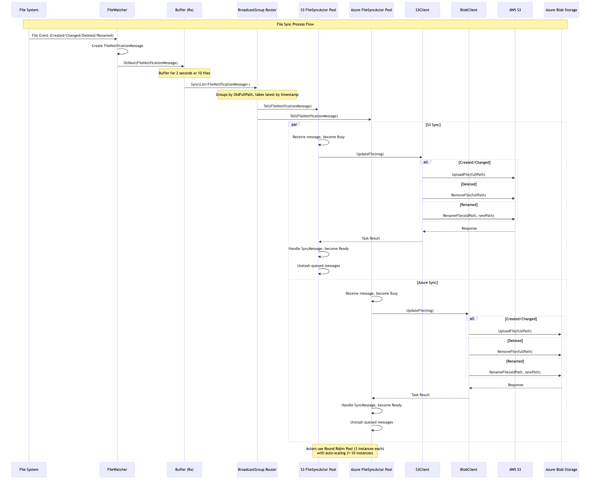

# FileSync - Akka.NET File Synchronization Service

A real-time file synchronization service built with Akka.NET that monitors file system changes and synchronizes files to cloud storage providers (AWS S3 and Azure Blob Storage).

## Features

- **Real-time file monitoring** using FileSystemWatcher
- **Multiple cloud storage support** (AWS S3, Azure Blob Storage)
- **Actor-based architecture** using Akka.NET for high concurrency
- **Buffered synchronization** to batch file changes
- **Resilient processing** with actor supervision and routing
- **Docker support** for containerized deployment

## Architecture

The application uses the Actor Model pattern with:
- **FileWatcher**: Monitors file system changes using reactive extensions
- **FileSyncActor**: Handles file synchronization to cloud storage
- **CounterActor**: Tracks synchronization statistics
- **Router**: Distributes work across multiple actor instances

[](diagram.png)

## Prerequisites

- .NET 8.0 SDK
- AWS account with S3 access (optional)
- Azure Storage account (optional)
- Docker (for containerized deployment)

## Configuration

Update `Runner/appsettings.json` with your settings:

```json
{
  "fileSystem": "fw-sytem",
  "fileToWatch": "/path/to/watch/directory",
  "storage": {
    "s3": {
      "secretKey": "your-secret-key",
      "accessKey": "your-access-key",
      "bucketName": "synced-files",
      "minio": "false",
      "serviceURL": "https://s3.amazonaws.com"
    },
    "blob": {
      "connectionString": "DefaultEndpointsProtocol=https;AccountName=...",
      "bucketName": "synced-files"
    }
  }
}
```

## How to Run

### Using .NET CLI

1. **Restore dependencies**:
   ```bash
   dotnet restore
   ```

2. **Build the solution**:
   ```bash
   dotnet build
   ```

3. **Run the application**:
   ```bash
   dotnet run --project Runner
   ```

### Using Docker

1. **Build and run with Docker Compose**:
   ```bash
   cd Runner
   docker-compose up --build
   ```

### Development Setup

For local development with MinIO (S3-compatible storage):

1. **Start MinIO server**:
   ```bash
   docker run -p 9000:9000 -p 9001:9001 \
     -e "MINIO_ROOT_USER=minioadmin" \
     -e "MINIO_ROOT_PASSWORD=minioadmin" \
     minio/minio server /data --console-address ":9001"
   ```

2. **Update appsettings.json** for MinIO:
   ```json
   "s3": {
     "secretKey": "minioadmin",
     "accessKey": "minioadmin",
     "bucketName": "synced-files",
     "minio": "true",
     "serviceURL": "http://localhost:9000"
   }
   ```

3. **For Azure Storage Emulator**:
   ```json
   "blob": {
     "connectionString": "UseDevelopmentStorage=true",
     "bucketName": "synced-files"
   }
   ```

## Usage

Once running, the application will:
1. Monitor the specified directory for file changes
2. Buffer changes for 2 seconds or up to 10 files
3. Synchronize files to both S3 and Azure Blob Storage
4. Display status messages in the console

### Interactive Commands

- **`count`**: Display synchronization statistics
- **`q`**: Quit the application

## Project Structure

```
FileSync/
├── FileSync.sln                 # Solution file
├── FileSync/                    # Core library
│   ├── Actors/                  # Actor implementations
│   ├── Clients/                 # Storage client abstractions
│   ├── Configuration/           # Configuration models
│   ├── Messages/                # Actor message types
│   ├── Utils/                   # Utility classes
│   └── Watcher/                 # File system monitoring
└── Runner/                      # Console application
    ├── Program.cs               # Application entry point
    ├── appsettings.json         # Configuration file
    └── docker-compose.yaml      # Docker deployment
```

## Dependencies

- **Akka.NET**: Actor framework for concurrent processing
- **AWS SDK**: S3 client for Amazon Web Services
- **Azure Storage**: Blob storage client for Microsoft Azure
- **System.Reactive**: Reactive extensions for event handling
- **Microsoft.Extensions.Configuration**: Configuration management
